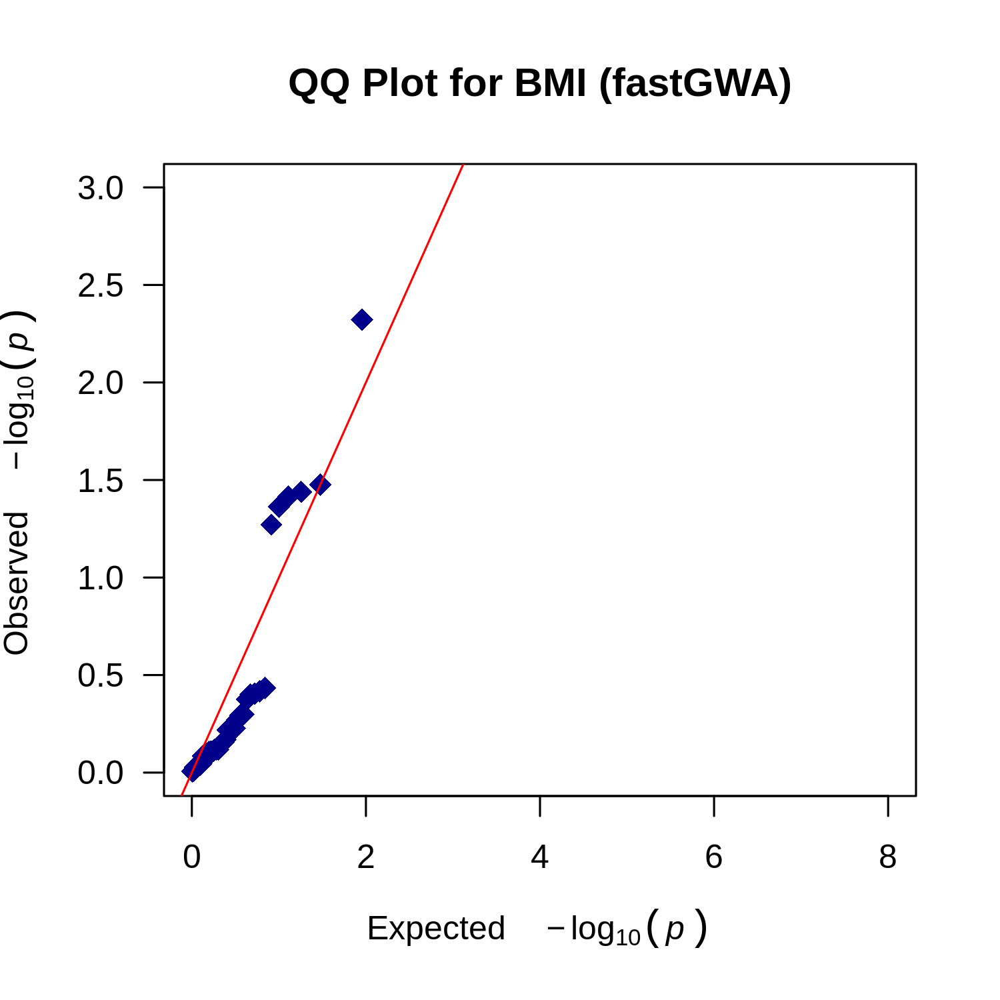
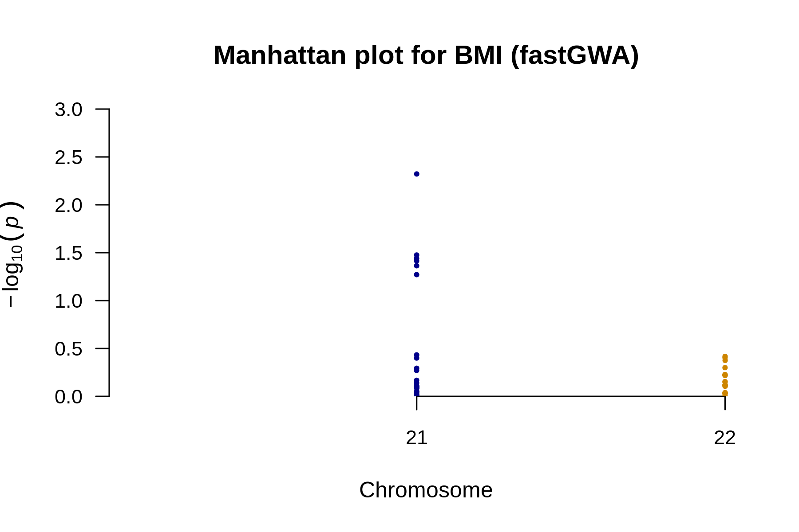
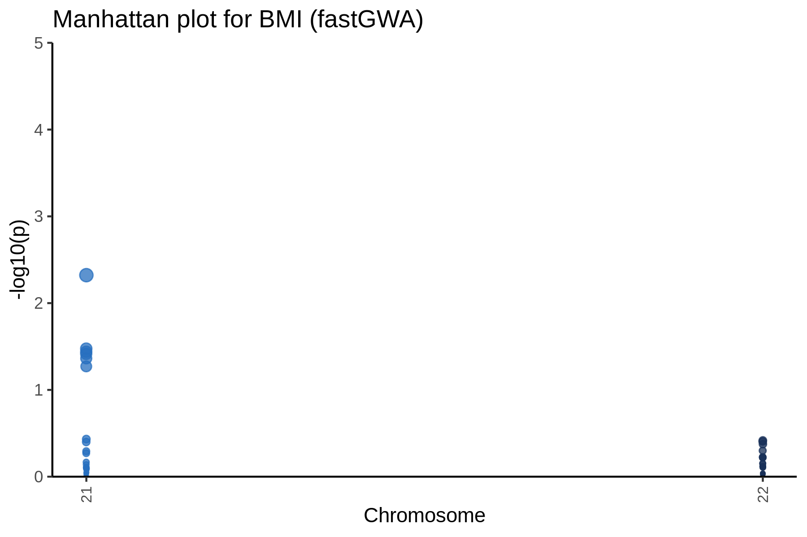

# QQ plot for BMI



---

# Manhattan plot for BMI



---

# Manhattan plot for BMI



---

# Result files
```
/Users/supengyuan/Documents/GitHub/orientation/data/LMM_MWE/output/phenotypes_BMI.fastGWA.analysis_summary.html
/Users/supengyuan/Documents/GitHub/orientation/data/LMM_MWE/output/phenotypes_BMI.fastGWA.analysis_summary.md
/Users/supengyuan/Documents/GitHub/orientation/data/LMM_MWE/output/phenotypes_BMI.fastGWA.analysis_summary.pptx
/Users/supengyuan/Documents/GitHub/orientation/data/LMM_MWE/output/phenotypes_BMI.fastGWA.manhattan_annotated.png
/Users/supengyuan/Documents/GitHub/orientation/data/LMM_MWE/output/phenotypes_BMI.fastGWA.manhattan.png
/Users/supengyuan/Documents/GitHub/orientation/data/LMM_MWE/output/phenotypes_BMI.fastGWA.plot_data.rds
/Users/supengyuan/Documents/GitHub/orientation/data/LMM_MWE/output/phenotypes_BMI.fastGWA.qq.png
/Users/supengyuan/Documents/GitHub/orientation/data/LMM_MWE/output/phenotypes_BMI.fastGWA.snp_counts.txt
/Users/supengyuan/Documents/GitHub/orientation/data/LMM_MWE/output/phenotypes_BMI.fastGWA.snp_stats.gz
/Users/supengyuan/Documents/GitHub/orientation/data/LMM_MWE/output/phenotypes_BMI.fastGWA.snp_stats.log
/Users/supengyuan/Documents/GitHub/orientation/data/LMM_MWE/output/phenotypes_BMI.fastGWA.snp_stats_original_columns.gz
```
